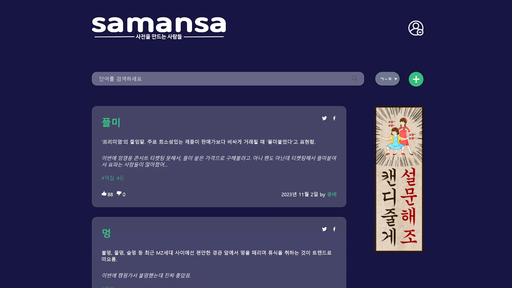
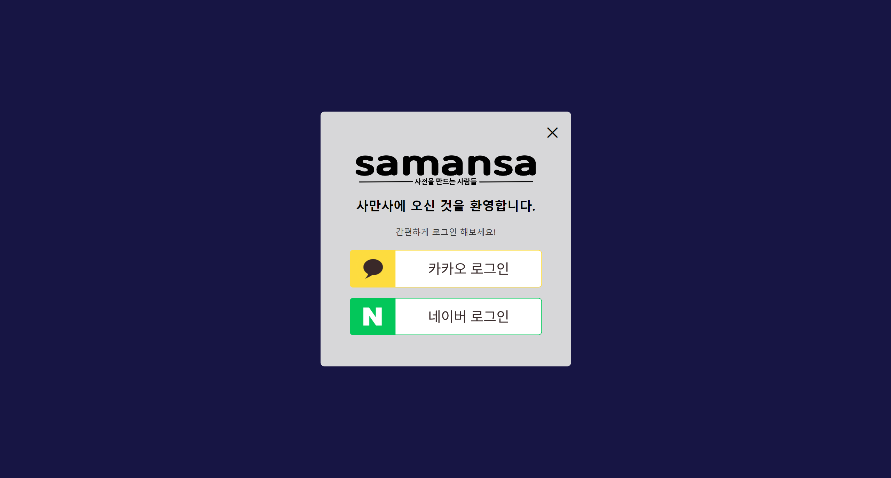
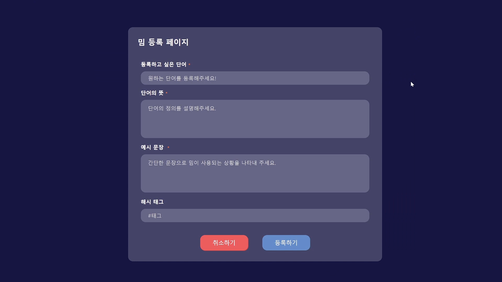
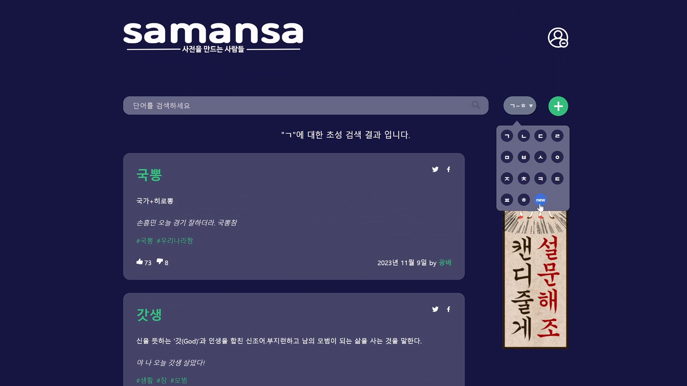
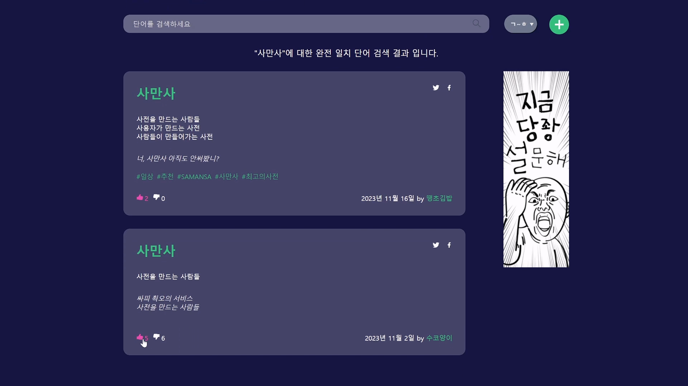
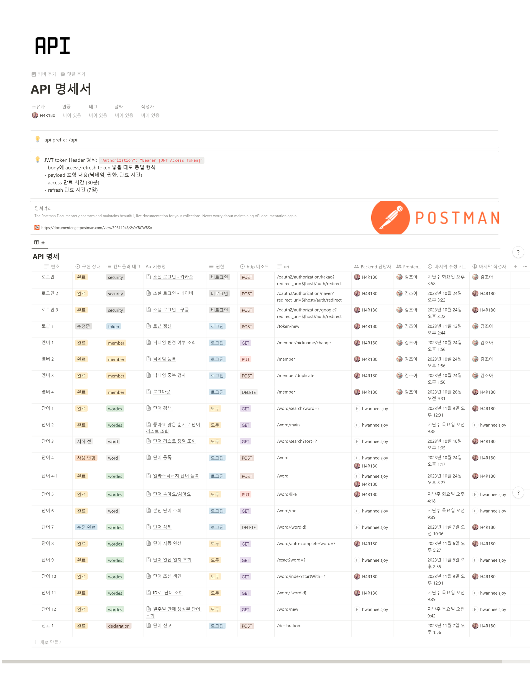
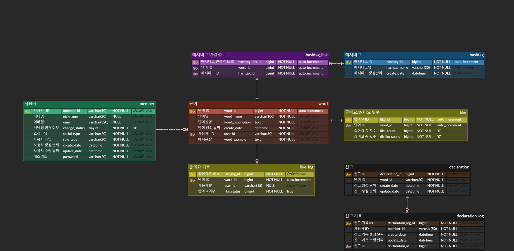
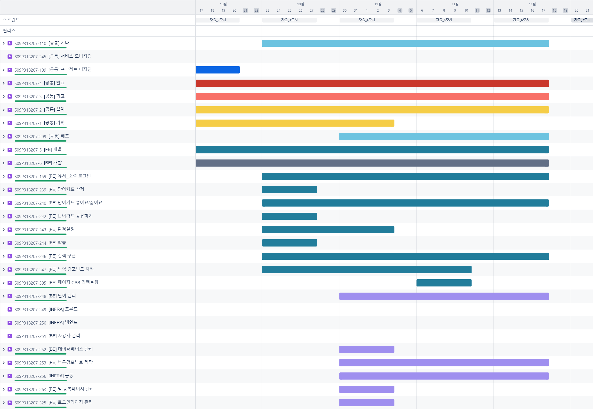
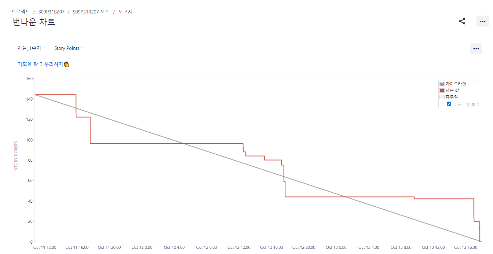
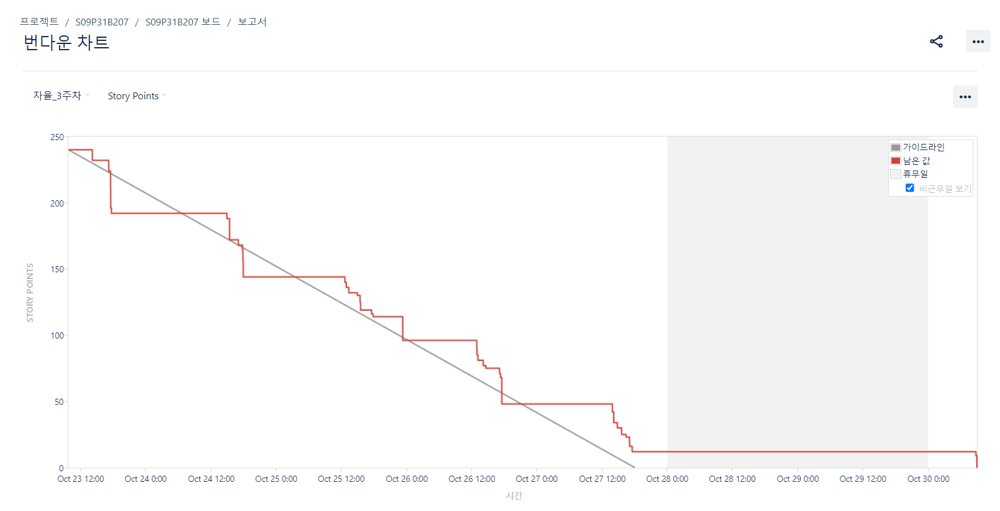

### 목차

| [소개](#소개)                               | [구현](#구현)                                           | [마치며](#마치며)                           |
| :------------------------------------------ | :------------------------------------------------------ | :------------------------------------------ |
| [:book: 개요](#book-개요)                   | [:dart: 주요 페이지 및 기능](#dart-주요-페이지-및-기능) | [:boy: 팀원](#boy-팀원)                     |
| [:bulb: 프로젝트 기획](#bulb-프로젝트-기획) | [:rocket: 기능시연](#rocket-기능시연)                   | [:mega: 소감](#mega-소감)                   |
| [:cactus: 빌드 환경](#cactus-빌드-환경)     | [:eyes: 산출물](#eyes-산출물)                           | [:seedling: 회고 기록](#seedling-회고-기록) |
|                                             | [:books: 파일 구조도](#books-파일-구조도)               |                                             |

<br/>

# 소개

## :book: 개요

**_👏 SSAFY 9기 2학기 자율 프로젝트 👏_**

> 2023.10.10 ~ 2023.11.17 (6주)

**Project. SAMANSA**
(Team. 사전을 만드는 사람들)

<br/>

[🔼 목차로 돌아가기](#목차)

<br/>

## :bulb: 프로젝트 기획

> 사용자가 만드는 사전,
>
> 사람들이 만드는 사전,
>
> 사전을 만드는 사람들이 완성한
>
> **SAMANSA**

<br/>

### 배경

**당신이 원하는 모든 것을 검색해보세요.**

<hr>

> 하루가 다르게 생기는 신조어들은 사람들 사이의 소통에 장애를 가져오고 있습니다. 예전에는 신조어 때문에 세대 간의 의사소통이 어려워 갈등이 심해진다고 하였지만 최근의 뉴스는 이 신조어로 인하여 같은 세대 안에서도 소통에 어려움을 겪고 있는 일이 많습니다.
>
> 신조어를 포탈에서 검색하면 맨 처음에 ‘ㅇㅇ 뜻’ 이 자동완성에 가장 먼저 뜨는 만큼 요즘 사람들은 인터넷 포털 사이트에서 단어의 뜻을 많이 찾아보고 있습니다. 하지만 포탈에서 검색어를 찾아보는 경우 쉽게 뜻이 나오지 않는 경우도 많습니다.

**저희가 제공하고자 하는 서비스는 사용자가 직접 단어에 대해 정의를 하고, 다른 사용자들이 그 단어에 대하여 평가하여 단어 사전을 만들어 가는 서비스입니다.**

> 다른 사람들과 소통을 하며 모르는 단어가 나오면 그 단어가 무슨 뜻으로 쓰이는지 쉽게 찾아볼 수 있는 사용자 정의 사전 서비스를 만들고 싶었습니다.

<br/>

[🔼 목차로 돌아가기](#목차)

<br/>

## :cactus: 빌드 환경

| FrontEnd          | BackEnd                                      | Database            | Infra                        |
| :---------------- | :------------------------------------------- | :------------------ | :--------------------------- |
| React 18.2.0      | Java 17 (Azul Zulu version 17.0.8)           | MySQL 8.0.33        | Vultr EC2 (Ubuntu 20.04 LTS) |
| Next.js 13.5.4    | Spring Boot 3.1.4                            | Redis 7.2.1         | Vultr Kubernetes 1.27.6      |
| TypeScript 5.2.2  | Gradle 8.2.1                                 | Elasticsearch 8.7.1 | Nginx 1.18.0                 |
| Recoil 0.7.7      | Spring Data JPA                              |                     | Jenkins 2.427                |
| React-Query 5.0.5 | IntelliJ IDEA 2023.1.3<br>(Ultimate Edition) |                     | Docker latest                |
| ModuleCSS         | lombok                                       |                     | LoadBalancer                 |
| HTML5             | JWT                                          |
| yarn berry 3.6.4  |
| node 18.17.1 LTS  |

<br>

[🔼 목차로 돌아가기](#목차)

<br>

# 구현

## :dart: 주요 페이지 및 기능

### 메인 페이지



<!--  -->

### 소셜 로그인 & 회원가입 & 닉네임 검사

|                                                  로그인                                                   |                                                                         닉네임 검사                                                                         |
| :-------------------------------------------------------------------------------------------------------: | :---------------------------------------------------------------------------------------------------------------------------------------------------------: |
|                                                    |                                                                                                  |
| 사용자 편의성을위해 소셜 로그인을 구현했습니다.<br>카카오와 네이버 계정으로 로그인/회원가입이 가능합니다. | 회원가입을 한 경우, 최초 로그인 사용자로 판단해 닉네임 설정 페이지로 이동하게 됩니다. <br> 닉네임을 지정하면 가입이 완료됩니다.<br>닉네임은 중복확인합니다. |

<br/>

[🔼 목차로 돌아가기](#목차)

<br/>

### 단어 등록하기



- 사용자는 본인이 원하는 단어에 대한 정의를 직접 등록할 수 있습니다.
- 해당 단어에 대한 예시 문장을 통해 단어에 대한 이해를 높일 수 있습니다.
- 단어를 정의할 수 있는 해시태그를 직접 등록합니다.

<br>

### 검색 및 검색 결과


- 사용자는 궁금한 단어를 검색해볼 수 있습니다.
- 검색 결과에 대한 단어의 정의를 확인할 수 있습니다.
- Elasticsearch를 통해 입력하는 단어에 대한 자동완성 기능을 지원합니다.

<br>

### 색인 기능으로 단어 검색하기



- 색인 기능을 통해 단어를 검색할 수 있게 사전의 사용성을 높였습니다.
- ㄱ~ㅎ 버튼 외의 **new** 버튼을 통해 최신 7일 간의 등록 단어를 색인할 수 있습니다.

<br>

### 좋아요, 싫어요로 단어 평가하기



- 사용자는 단어에 대해 좋아요/싫어요를 눌러 단어를 평가할 수 있습니다.
- 단어에 대한 좋아요/싫어요를 누르면 해당 단어의 좋아요/싫어요 개수가 증가합니다.
- 좋아요/싫어요 점수로 메인 페이지의 단어 출력 순서가 결정됩니다.
- 좋아요/싫어요 기능은 IP를 기준으로 하기 때문에 비로그인 상태로도 이용할 수 있습니다.

<br>

### 단어 삭제하기 & 신고하기 & 공유하기

- 사용자는 본인이 등록한 단어를 삭제할 수 있습니다.
- 사용자는 단어를 SNS(트위터, 페이스북)로 공유할 수 있습니다.
- 로그인한 사용자는 올바르지 않다고 생각하는 단어에 대해 신고를 진행할 수 있습니다.

<br>

### 모바일 화면 지원

- 모바일 기기로 서비스를 이용하는 사용자를 위해 모바일 화면을 지원합니다.

<br>

<br/>

[🔼 목차로 돌아가기](#목차)

<br/>

## :eyes: 산출물

|                    요구사항명세서                     |
| :---------------------------------------------------: |
|  |

|                API 명세서                |               API 명세서(세부)               |
| :--------------------------------------: | :------------------------------------------: |
|  |  |

|             ERD              |
| :--------------------------: |
|  |

|                   시스템 구조도                   |            지라 이슈             |
| :-----------------------------------------------: | :------------------------------: |
|  |  |

### 지라 번다운 차트

|                 1주차 스프린트                  |                 2주차 스프린트                  |                 3주차 스프린트                  |
| :---------------------------------------------: | :---------------------------------------------: | :---------------------------------------------: |
|  |  |  |

|                  4주차 스프린트                  |                  5주차 스프린트                  |                  6주차 스프린트                  |
| :----------------------------------------------: | :----------------------------------------------: | :----------------------------------------------: |
|  |  |  |

### 최종발표 PPT


<br>

[🔼 목차로 돌아가기](#목차)

<br/>

## :books: 파일 구조도

### FrontEnd

```
📦frontend
 ┣ 📂.next
 ┣ 📂.storybook
 ┣ 📂public
 ┃ ┣ 📂assets
 ┃ ┃ ┣ 📂form
 ┃ ┃ ┣ 📂login
 ┣ 📂src
 ┃ ┣ 📂app
 ┃ ┃ ┣ 📂(main)
 ┃ ┃ ┣ 📂auth
 ┃ ┃ ┃ ┣ 📂login
 ┃ ┃ ┃ ┃ ┣ 📂_components
 ┃ ┃ ┃ ┃ ┃ ┣ 📂KakaoLoginButton
 ┃ ┃ ┃ ┃ ┃ ┗ 📂NaverLoginButton
 ┃ ┃ ┃ ┣ 📂nickname
 ┃ ┃ ┃ ┗ 📂redirect
 ┃ ┃ ┣ 📂create
 ┃ ┃ ┣ 📂fonts
 ┃ ┃ ┣ 📂test
 ┃ ┣ 📂components
 ┃ ┃ ┣ 📂Button
 ┃ ┃ ┃ ┣ 📂CreateButton
 ┃ ┃ ┃ ┣ 📂DeleteButton
 ┃ ┃ ┃ ┣ 📂IndexButton
 ┃ ┃ ┃ ┣ 📂LikeButton
 ┃ ┃ ┃ ┣ 📂LogoutButton
 ┃ ┃ ┃ ┣ 📂PaginationButton
 ┃ ┃ ┃ ┣ 📂ReportButton
 ┃ ┃ ┃ ┣ 📂RouteButton
 ┃ ┃ ┃ ┣ 📂ShareButton
 ┃ ┃ ┃ ┣ 📂VoteButton
 ┃ ┃ ┃ ┣ 📂WordVoteButton
 ┃ ┃ ┣ 📂Card
 ┃ ┃ ┣ 📂Form
 ┃ ┃ ┣ 📂Header
 ┃ ┃ ┣ 📂Input
 ┃ ┃ ┃ ┣ 📂SearchInput
 ┃ ┃ ┃ ┗ 📂ValueInput
 ┃ ┃ ┣ 📂Modal
 ┃ ┃ ┣ 📂Skeleton
 ┃ ┃ ┗ 📂Textarea
 ┃ ┣ 📂context
 ┃ ┣ 📂store
 ┃ ┣ 📂stories
 ┃ ┃ ┗ 📂assets
 ┃ ┣ 📂utils
 ┃ ┃ ┣ 📂loader
 ┃ ┗ 📂vendor
 ┗ 📜yarn.lock

```

### BackEnd

```

📦backend/memetionary
 ┣ 📂gradle
 ┃ ┗ 📂wrapper
 ┃ ┃ ┣ 📜gradle-wrapper.jar
 ┃ ┃ ┗ 📜gradle-wrapper.properties
 ┣ 📂src
 ┃ ┣ 📂main
 ┃ ┃ ┣ 📂java
 ┃ ┃ ┃ ┗ 📂com
 ┃ ┃ ┃ ┃ ┗ 📂ssafy
 ┃ ┃ ┃ ┃ ┃ ┗ 📂memetionary
 ┃ ┃ ┃ ┃ ┃ ┃ ┣ 📂common
 ┃ ┃ ┃ ┃ ┃ ┃ ┃ ┣ 📂controller
 ┃ ┃ ┃ ┃ ┃ ┃ ┃ ┣ 📂dto
 ┃ ┃ ┃ ┃ ┃ ┃ ┃ ┣ 📂entity
 ┃ ┃ ┃ ┃ ┃ ┃ ┃ ┣ 📂exception
 ┃ ┃ ┃ ┃ ┃ ┃ ┣ 📂config
 ┃ ┃ ┃ ┃ ┃ ┃ ┣ 📂declaration
 ┃ ┃ ┃ ┃ ┃ ┃ ┃ ┣ 📂controller
 ┃ ┃ ┃ ┃ ┃ ┃ ┃ ┣ 📂dto
 ┃ ┃ ┃ ┃ ┃ ┃ ┃ ┣ 📂entity
 ┃ ┃ ┃ ┃ ┃ ┃ ┃ ┣ 📂repository
 ┃ ┃ ┃ ┃ ┃ ┃ ┃ ┗ 📂service
 ┃ ┃ ┃ ┃ ┃ ┃ ┣ 📂hashtag
 ┃ ┃ ┃ ┃ ┃ ┃ ┃ ┣ 📂entity
 ┃ ┃ ┃ ┃ ┃ ┃ ┃ ┣ 📂repository
 ┃ ┃ ┃ ┃ ┃ ┃ ┃ ┗ 📂service
 ┃ ┃ ┃ ┃ ┃ ┃ ┣ 📂link
 ┃ ┃ ┃ ┃ ┃ ┃ ┃ ┣ 📂entity
 ┃ ┃ ┃ ┃ ┃ ┃ ┃ ┣ 📂repository
 ┃ ┃ ┃ ┃ ┃ ┃ ┃ ┗ 📂service
 ┃ ┃ ┃ ┃ ┃ ┃ ┣ 📂member
 ┃ ┃ ┃ ┃ ┃ ┃ ┃ ┣ 📂controller
 ┃ ┃ ┃ ┃ ┃ ┃ ┃ ┣ 📂dto
 ┃ ┃ ┃ ┃ ┃ ┃ ┃ ┣ 📂entity
 ┃ ┃ ┃ ┃ ┃ ┃ ┃ ┣ 📂repository
 ┃ ┃ ┃ ┃ ┃ ┃ ┃ ┗ 📂service
 ┃ ┃ ┃ ┃ ┃ ┃ ┣ 📂oauth2
 ┃ ┃ ┃ ┃ ┃ ┃ ┃ ┣ 📂domain
 ┃ ┃ ┃ ┃ ┃ ┃ ┃ ┣ 📂dto
 ┃ ┃ ┃ ┃ ┃ ┃ ┃ ┣ 📂filter
 ┃ ┃ ┃ ┃ ┃ ┃ ┃ ┣ 📂handler
 ┃ ┃ ┃ ┃ ┃ ┃ ┃ ┣ 📂repository
 ┃ ┃ ┃ ┃ ┃ ┃ ┃ ┣ 📂service
 ┃ ┃ ┃ ┃ ┃ ┃ ┃ ┗ 📂token
 ┃ ┃ ┃ ┃ ┃ ┃ ┣ 📂util
 ┃ ┃ ┃ ┃ ┃ ┃ ┣ 📂word
 ┃ ┃ ┃ ┃ ┃ ┃ ┃ ┣ 📂controller
 ┃ ┃ ┃ ┃ ┃ ┃ ┃ ┣ 📂dto
 ┃ ┃ ┃ ┃ ┃ ┃ ┃ ┣ 📂entity
 ┃ ┃ ┃ ┃ ┃ ┃ ┃ ┣ 📂repository
 ┃ ┃ ┃ ┃ ┃ ┃ ┃ ┗ 📂service
 ┃ ┃ ┃ ┃ ┃ ┃ ┣ 📂wordes
 ┃ ┃ ┃ ┃ ┃ ┃ ┃ ┣ 📂controller
 ┃ ┃ ┃ ┃ ┃ ┃ ┃ ┣ 📂document
 ┃ ┃ ┃ ┃ ┃ ┃ ┃ ┣ 📂dto
 ┃ ┃ ┃ ┃ ┃ ┃ ┃ ┣ 📂repository
 ┃ ┃ ┃ ┃ ┃ ┃ ┃ ┗ 📂service
 ┃ ┃ ┗ 📂resources
 ┃ ┃ ┃ ┣ 📂elasticsearch
 ┃ ┗ 📂test
 ┃ ┃ ┗ 📂java
 ┃ ┃ ┃ ┗ 📂com
 ┃ ┃ ┃ ┃ ┗ 📂ssafy
 ┃ ┃ ┃ ┃ ┃ ┗ 📂memetionary
 ┣ 📜build.gradle
 ┣ 📜Dockerfile

```

<br/>

[🔼 목차로 돌아가기](#목차)

<br/>

# 마치며

## :boy: 팀원

<table>
    <tr>
        <td height="140px" align="center"> <a href="https://github.com/Juahjoah">
             <br><br> 👑 김주아 <br>(Front-End) </a> <br></td>
        <td height="140px" align="center"> <a href="https://github.com/ninnistic">
             <br><br> 🎀 박지영 <br>(Front-End) </a> <br></td>
        <td height="140px" align="center"> <a href="https://github.com/H4R1B0">
             <br><br> 🐲 박현준 <br>(Back-End) </a> <br></td>
        <td height="140px" align="center"> <a href="https://github.com/Joungwon">
             <br><br> 🌳 석정원 <br>(Front-End) </a> <br></td>
        <td height="140px" align="center"> <a href="https://github.com/jungmin0049">
             <br><br> 🧸 손정민 <br>(Front-End) </a> <br></td>
        <td height="140px" align="center"> <a href="https://github.com/hwanheeisjoy">
             <br><br> 🦦 조환희 <br>(Back-End) </a> <br></td>
    </tr>
</table>

### 팀원 역할 상세

<br/>

[🔼 목차로 돌아가기](#목차)

<br/>

## :mega: 소감

<br/>

### 😊 김주아

> 싸피 내에서 진행한 마지막 프로젝트! <br>
> 일단 모든 팀원들에게 감사하다는 말씀드리고 싶습니다. <br>
> 👏👏👏우리 모두 고생했다!👏👏👏
>
> 싸피에서 진행하는 마지막 프로젝트인만큼 단순 구현만을 목표로했던 지금까지와는 다른 부분을 고려하기 위해 노력했고, 고민도 많이 했던 프로젝트였습니다. 이전 프로젝트에서 사용했던 React도, TypeScript도 프로젝트를 진행하면서 처음 사용한 것들이었지만, 구현만을 목표로 했기 때문에 사용성이나 효율성에 대한 고민은 차순위로 미뤄뒀었습니다. 이번 프로젝트에서는 사용성을 높이기 위해 많이 고민했습니다. <br>
> 또, 4명이나 되는 프론트 담당자들끼리 같이 협업해나가는 과정 역시 새로운 경험이었습니다. 단순한 구현이 아니라, 프로젝트의 성능을 높이기 위해 구현하는 과정을 거치면서 모두가 성장할 수 있었다고 생각합니다. <br>
> 목표를 달리 잡은 만큼 프로젝트 규모를 작게 잡았지만, 절대 해야할 업무가 적지 않았습니다.💦 오히려 작기 때문에 완성도를 위해 고민하고 끊임없이 리팩토링을 했습니다. 물론, 아쉬웠던 부분이 없다면 거짓말이지만, 나름 최선의 노력을 했기 때문에 모두가 만족스러운 결과였으면 좋겠고, 저 역시도 여러분과 함께해서 이만큼의 결과를 냈다고 생각합니다. <br>
> 기존 목표였던 실사용성 높은 서비스에 한 발짝 가까워졌지만, 아직 완벽하지는 않다고 생각합니다. 또, 해보고 싶었지만, 프로젝트에 녹여내지 못한 코드들도 존재합니다. 이런 부분을 개선해 더 멋진 "SAMANSA"를 만들 기회가 있었으면 좋겠습니다. <br>
> 다들 수고했어요 여러분!

<br>

### 😎 박지영

> 이번 프로젝트는 Next.js를 잘 활용해 보는데에 의의를 두고자 가볍게 기획하고 시작했던 프로젝트였습니다. 때문에 프로젝트 규모 자체도 크지 않았습니다. 하지만 규모와 상관없이 의미있는 과정들을 많이 마주할 수 있었습니다.
>
> SSR과 CSR을 이용한 하이브리드 방식으로 웹을 구축하는 과정에서 느린 로딩속도를 위해 lighthouse를 이용해 성능지표를 확인했고, 또 실제로 낮은 점수를 70점 이상으로 끌어올리기 위해 많은 구글링과 고민을 해 가며 해결하기 위해 노력했던 점이 가장 기억에 남습니다. 덕분에 Next.js에서의 폰트 최적화와, CSR과 SSR의 차이점에 대해서도 좀 더 깊게 접근할 수 있었습니다. <br>
> 여유있게 프로젝트를 하는 시간을 가진 덕에 안되는 부분에 대해 고민하는 시간을 오래 가질 수 있어서 좋았습니다. 덕분에 “무작정 되게하라”가 아니라, “왜 안되는지”로 접근해서 프로젝트의 해결 과정을 논리적으로 가져갈 수 있었습니다. <br>
> 아쉬웠던 부분은, SSAFY에서의 마지막 프로젝트라 정신적으로 체력적으로 부담이 커서 더욱 적극적으로 프로젝트에 임할 수 있음에도 불구하고, 스스로 제약을 둔 상황이라 생각합니다. 우리가 기획한 Samansa는 프로젝트를 떠나서 객관적으로 서비스로서의 가치와 확장성이 크다고 생각합니다. 시간과 체력이 허락했다면 이 서비스를 더욱 유용하게 발전시킬 수 있는 부분이 많았다고 생각합니다. 밈이나 이미지, 혹은 비디오를 연관시켜 이 사이트를 사용하는 유저의 입장에서 편리하게 사용해볼법할 기능들을 넣지 못한 것이 아쉬움으로 남습니다.
>
> 이번 프로젝트에서 프론트엔드 개발자로서 성능개선에도 힘을 써야하고, 또 그 방법을 어떻게 이루어나가는지에 대해 배울 수 있어서 뜻깊은 시간이었다고 생각합니다. 다음에 프로젝트를 한다면 좀 더 섬세하게 프로젝트를 구축하고 계획적으로 해 나가고 싶습니다. 또한 팀원들과의 소통을 좀 더 적극적으로 하여 여러명이 작성하지만 좀 더 획일화되고 균일한 개발 결과물을 내어 모두가 그저 “작동”만되는 결과에 그치지 않고, 추후에는 과정에서도 의미있는 코드를 짤 수 있는 방향으로 발전하고 싶습니다.

<br>

### 🍇 박현준

> 평소에 궁금해했던 엘라스틱 서치를 접하고 직접 설계하고 개발해보는 시간이었습니다.
> 편하다고 느꼈던 자동완성같은 기능을 개발해보면서 이렇게나 어렵구나 느꼈습니다.
> 인프라 공부할때 써보고 싶었던 쿠버네티스도 작게나마 프로젝트에 적용해보는 시간이었습니다.
> 찾아보면서 알아가는게 너무 즐거운 프로젝트 경험이었습니다!!
> 팀원 모두 사비를 많이 들였지만... (가격이 너무 비쌌다. 그것만 빼면 좋은 경험이었다.)

<br>

### 🏡 석정원

> React와 Next.Js간 큰 차이점이 없을 거라 생각했지만 생각보다 다른 점이 존재하였었고, 서버사이드와 클라이언트사이드의 렌더링의 방식에도 차이도 있었습니다. 때문에 검색엔진을 최적화 하는 방식을 찾고 학습하는과정이 길었던 프로젝트였습니다.
>
> 가장 어려운 부분은 사이트의 느린 랜더링 속도를 개선하기위해 CSR 컴포넌트의 브라우저와 서버간의 통신과정을 최적화하는 분이었습니다. 초기에 LightHouse에서 43점이라는 성능지수를 받았는데 4번의 리팩토링을 거쳐 최소 75점이 넘는 결과를 만들어 낼 수 있었습니다. 먼저 필터조건을 타인에게 공유하는 기능을 유지하면서도 렌더링 횟수를 최소화하기 위한 노력을 하였으나 그러한 노력은 성능에 영향을 크게 미치지 못했고, Network Waterfall을 분석해가며 코드 스플리팅을 통해 번들링 파일 사이즈를 경량화, react-icons 번들 사이즈의 chunk크기를 줄이고 컴포넌트의 리플로우를 일으키는 속성 사전정의를 통해 Layout shirt 최적화 등의 시행착오를 격으며 사이트의 성능향상과 검색엔진 최적화 두가지 이점을 챙길 수 있게 되었습니다.
>
> 이번 프로젝트를 통해 성능저하를 접했을 때 해결방안을 찾는 부분에 있어서 많은 성장을 할 수 있었습니다. 한 두개의 컴포넌트가 아닌 다양한 파일 구조를 함께 확인하고 불필요한 코드를 줄이는 습관을 기를 수 있었고 이 경험은 앞으로 개발을 진행하면서 접하게 될 다양한 문제들을 잘 해결해 나갈 수 있는 발판이 될 것이라고 생각합니다.

<br>

### 🥳 손정민

> 안녕하세요 저는 손정민입니다. 만나서 반갑습니다. <br>
> 이번에는 다른 프로젝트에서 시도하지 못했던 여러가지를 할 수 있어서 좋았습니다. Next.js를 사용하여 SSR으로 page를 제작한다던가, 사용자의 편의성을 생각하여 좀 더 로드가 빨리되도록 여러방법을 시도해 볼 수 있었던 것이 좋았습니다. <br>
> 특히나 SSR과 CSR에 대해서 공부하며 웹의 구동방식에 대하여 더 잘 알수 있게 되었고, 데이터수집을 위해 크롤링을 하고 SEO를 위해 사이트맵을 만들고, 구글 서치 콘솔등을 이용하여 결과를 확인하며 검색엔진에 대한 이해도도 높아졌습니다. <br>
> 앞으로는 webPack등을 사용하여 큰 자바스크립트가 좀 더 가볍게 실행될 수 있도록 수정하고 싶습니다.

<br>

### 👶 조환희

> 많은 기업에서도 사용하는 엘라스틱 서치를 사용해 볼 수 있어서 좋았습니다.
> 엘라스틱 서치는 검색할 때 조건을 주는 것이 아니라 단어를 분석해서 저장하고 그걸 바탕으로 검색하여 비슷한 단어들을 추천하기 때문에, AnalyzeRequest를 사용해서 단어들을 분석하는것이 조금 어려웠으나 최대한 사전처럼 만들기 위해 노력하였습니다.
>
> 많은 신조어랑 밈을 알게되었습니다.
> 마지막 프로젝트도 좋은 사람들과 재미있게 할 수 있어서 좋았습니다.

<br/>

## :seedling: 회고 기록

### [2주차 회고😁](/retrospective/2주차회고.md)

### [3주차 회고🤒](/retrospective/3주차회고.md)

### [4주차 회고🤭](/retrospective/4주차회고.md)

### [5주차 회고🤩](/retrospective/5주차회고.md)

<br/>

[🔼 목차로 돌아가기](#목차)
